<div align="center">

<h1>Hi, I'm YxinMiracle 👋</h1>


<p>
  <a href="https://blog.yxinmiracle.com/"></a>
  <a href="https://github.com/YxinMiracle"></a>
  
  
</p>

<p>
  <strong>Cybersecurity researcher · Guangzhou University alumnus</strong><br />
  Co-founder of an AI cybersecurity company
</p>

</div>

---

### `> whoami`

I research the security of large language models and AI agents. My work spans LLM guardrails, red teaming, multimodal AI safety, and natural language processing for cyber threat intelligence.

```text
research  : Cyber Threat Reports × Large Language Models
building  : LLM Security · NLP · Multimodal AI Safety · LLM Guardrails · Red Teaming · Agent Security
open src  : OpenSandbox · DeerFlow · Sigma · Qwen3Guard · Agent-Native
```

<div align="center">
  
</div>

### Open-source contributions

I'm passionate about open source and have contributed to [OpenSandbox](https://github.com/opensandbox-group/OpenSandbox), [DeerFlow](https://github.com/bytedance/deer-flow), [Sigma](https://github.com/SigmaHQ/sigma), [Qwen3Guard](https://huggingface.co/collections/Qwen/qwen3guard), and [Agent-Native](https://github.com/BuilderIO/agent-native).

### Selected publications

- 🎉🎉 — **Accepted paper at [USENIX Security 2026](https://www.usenix.org/conference/usenixsecurity26/presentation/cai)!** `CCF-A Conference`
  </br> *From Texts to Rules: Generating Sigma Rules with Large Language Models from Cyber Threat Reports* · [Paper](https://www.usenix.org/conference/usenixsecurity26/presentation/cai) · [PDF](https://www.usenix.org/system/files/conference/usenixsecurity26/sec26_prepub_cai.pdf)
- 🎉🎉 — **Accepted paper at [ACM SIGIR 2025](https://doi.org/10.1145/3726302.3729880)!** `CCF-A Conference`
  </br> *A Knowledge Extraction Framework on Cyber Threat Reports with Enhanced Security Profiles* · [Paper](https://doi.org/10.1145/3726302.3729880) · [Conference](https://sigir2025.dei.unipd.it/detailed-program/paper?paper=6a9aeddfc689c1d0e3b9ccc3ab651bc5)

### GitHub activity

<div align="center">
  <a href="https://github.com/ryo-ma/github-profile-trophy"></a>
</div>
